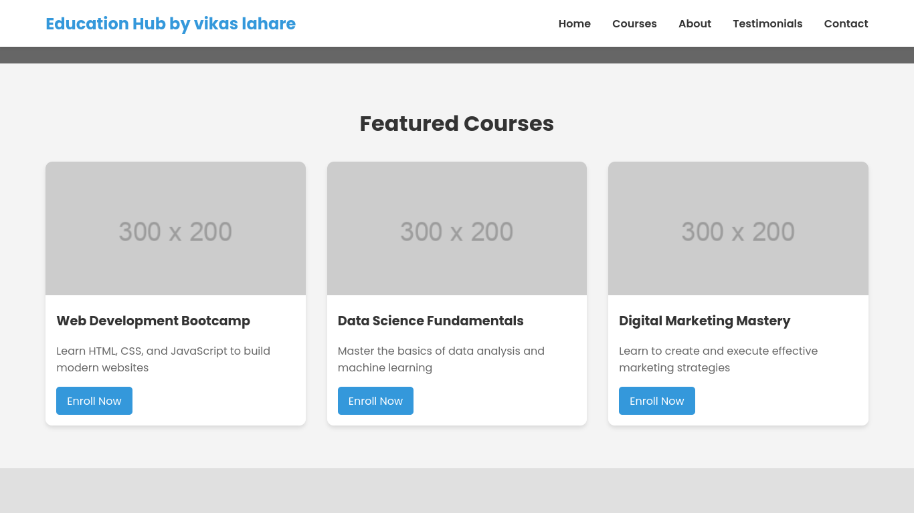
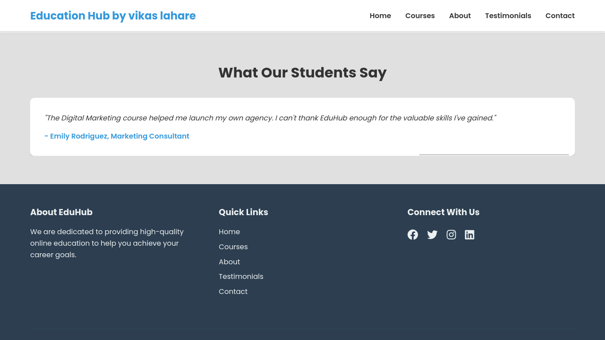

# Responsive-Online-Course-Website


```
git clone https://github.com/CryptoQuestVikas/Responsive-Online-Course-Website.git
cd Responsive-Online-Course-Website
```
# **Languages:**
> HTML CSS JAVASCRIPT ``I'm using internal css and javascript so remember this.``

# **Screenshot**



